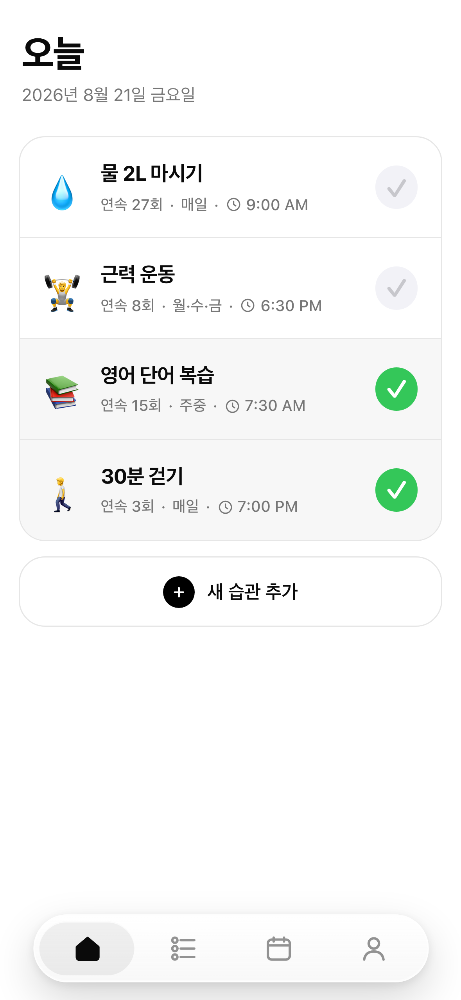
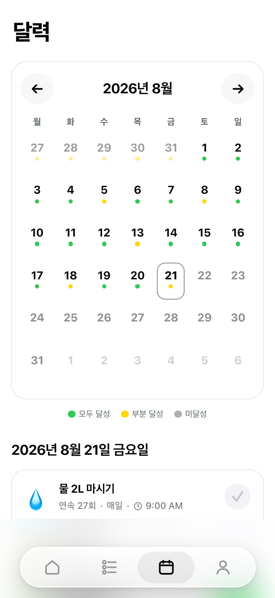
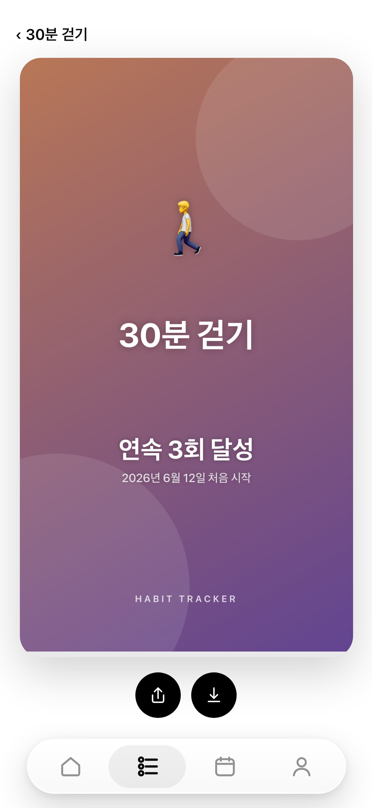

# Habit Tracker

초대받은 여러 회원이 각자의 스마트폰과 브라우저에서 개인 기록을 사용할 수 있는 습관 트래커입니다. iPhone과 Android의 홈 화면에 설치할 수 있는 모바일 우선 PWA이며, 자신의 서버에서 가볍게 운영하도록 설계했습니다.

- 오늘과 과거 날짜의 습관을 체크하고 수행 요일 변경 이력을 보존합니다.
- 습관별 총 달성 횟수, 최장 연속 달성과 현재 연속 달성을 보여줍니다.
- 습관 상세의 월간 달력에서 수행일별 달성 여부를 초록색과 회색 점으로 확인합니다.
- 습관별 시간 알림을 Web Push로 받고 여러 기기의 데이터를 동기화합니다.
- 습관과 세 가지 달성 통계를 내장 그라데이션이 적용된 9:16 이미지로 공유합니다.
- 회원과 admin은 주체별로 재사용 가능한 활성 초대 링크 하나를 관리하고, `.env`의 admin은 회원·초대·비밀번호 재설정을 담당하되 회원의 습관 내용에는 접근할 수 없습니다.

## 스크린샷

<table>
  <tr>
    <th>오늘</th>
    <th>달력</th>
    <th>성과 공유</th>
  </tr>
  <tr>
    <td></td>
    <td></td>
    <td></td>
  </tr>
</table>

## 기술 구성

- FastAPI, Jinja2, HTMX와 최소한의 JavaScript
- SQLAlchemy 2.x, Alembic, SQLite WAL
- 서비스 워커와 Web Push를 사용하는 설치형 PWA
- Uvicorn API와 별도 Python 알림 스케줄러
- WSL2 Ubuntu와 Docker Compose 기반 자체 호스팅

제품 규칙과 구현 범위는 [PRD](PRD.md)에서 자세히 확인할 수 있습니다.

## 로컬 실행

Python 3.12와 프로젝트 정책을 만족하는 SQLite가 필요합니다.

```bash
python3 -m venv .venv
.venv/bin/pip install -e '.[dev]'
cp .env.example .env
```

admin용 8자 이상의 비밀번호로 Argon2id 해시를 생성합니다. 비밀번호는 명령 인자나 `.env`에 평문으로 저장하지 않습니다.

```bash
.venv/bin/python -m app.auth.hash_password
```

최소 실행 설정을 `.env`에 입력합니다.

```dotenv
HABIT_TRACKER_USERNAME=admin
HABIT_TRACKER_PASSWORD_HASH='<생성한 Argon2id 해시>'
SESSION_SECRET=<32자 이상의 무작위 비밀 키>
SESSION_COOKIE_SECURE=false
DATABASE_URL=sqlite:///./data/habit_tracker.db
```

Compose 환경에서는 Argon2id 해시의 `$`가 변수 치환되지 않도록 해시 전체를 작은따옴표로 감쌉니다. `.env`는 애플리케이션이 권한을 자동 변경하지 않으므로 직접 보호해야 합니다.

```bash
chmod 600 .env
.venv/bin/alembic upgrade head
.venv/bin/uvicorn app.main:app --reload
```

이후 `http://127.0.0.1:8000`에 접속합니다.

`.env` 계정은 회원 관리 전용 admin입니다. admin으로 로그인해 초대 링크를 생성한 뒤, 해당 링크에서 일반 회원 계정을 만들어 습관 기능을 사용합니다. 일반 회원은 설정에서 자신의 초대 링크와 비밀번호를 관리할 수 있습니다.

### 수동 DB 백업

현재 애플리케이션에는 자동 백업 작업이 없습니다. 실행 중인 DB 파일을 단순 복사하지 말고 SQLite Online Backup API로 백업한 뒤 Compose volume 밖으로 복사합니다.

```bash
mkdir -p backups
backup_stamp=$(date +%Y%m%d-%H%M%S)
backup_name="habit_tracker-${backup_stamp}.db"

docker compose exec -T api python - "/data/$backup_name" <<'PY'
import sqlite3
import sys

source = sqlite3.connect("file:/data/habit_tracker.db?mode=ro", uri=True)
target = sqlite3.connect(sys.argv[1])
try:
    source.backup(target)
    check = target.execute("PRAGMA quick_check").fetchone()[0]
    if check != "ok":
        raise RuntimeError(f"백업 무결성 검사 실패: {check}")
finally:
    target.close()
    source.close()
print(sys.argv[1])
PY

docker compose cp "api:/data/$backup_name" "$PWD/backups/$backup_name"
```

호스트의 백업 파일에서 `PRAGMA quick_check`와 주요 테이블의 행 수를 확인하고, 운영 `.env`도 별도로 안전하게 보관합니다.

## Web Push 알림

VAPID 키는 최초 한 번만 생성하고 계속 보관합니다.

```bash
.venv/bin/python -m app.push.generate_vapid_keys
```

생성된 키와 발송자 정보를 `.env`에 추가합니다.

```dotenv
VAPID_PUBLIC_KEY=<생성된 공개 키>
VAPID_PRIVATE_KEY=<생성된 개인 키>
VAPID_SUBJECT=mailto:owner@example.com
REMINDER_POLL_SECONDS=30
REMINDER_LOOKBACK_MINUTES=5
```

개발 환경에서 예약 발송을 확인하려면 API와 별도로 스케줄러를 실행합니다.

```bash
.venv/bin/python -m app.reminders.scheduler
```

운영 환경의 PWA 설치와 Web Push에는 HTTPS가 필요합니다. 알림 권한은 앱의 안내에서 사용자가 직접 허용한 뒤 기기별 Push Subscription으로 등록됩니다. 습관의 알림 시각 전에 해당 날짜의 달성을 기록하면 그날 등록된 모든 기기의 알림을 생략합니다.

## 검사

```bash
.venv/bin/pytest
.venv/bin/ruff check .
.venv/bin/mypy app tests
```

## Docker Compose

운영 환경에서는 `SESSION_COOKIE_SECURE=true`를 사용하고 기존 HTTPS 리버스 프록시 뒤에서 실행합니다. Nginx는 `Host`, `X-Forwarded-For`, `X-Forwarded-Proto` 헤더를 전달해야 합니다. Compose의 Uvicorn은 Docker 게이트웨이에서 전달된 프록시 헤더를 인식하도록 `--proxy-headers --forwarded-allow-ips='*'`로 실행됩니다. 이 설정은 전달된 호스트와 프로토콜을 신뢰하므로 API 포트는 기본값처럼 `127.0.0.1:8000`에만 바인딩하고 인터넷에 직접 노출하지 않아야 합니다.

Nginx 프록시 설정에는 최소한 다음 헤더가 포함되어야 합니다.

```nginx
proxy_set_header Host $http_host;
proxy_set_header X-Real-IP $remote_addr;
proxy_set_header X-Forwarded-For $proxy_add_x_forwarded_for;
proxy_set_header X-Forwarded-Proto $scheme;
```

`X-Forwarded-Proto`가 전달되지 않거나 Uvicorn이 프록시를 신뢰하지 않으면 HTTPS 페이지가 `http://` 정적 자산 URL을 생성해 브라우저의 Mixed Content 정책에 차단될 수 있습니다.

```bash
docker compose build
docker compose up -d
```

SQLite DB는 `habit_data` named volume의 `/data/habit_tracker.db`에 저장됩니다. API와 단일 스케줄러 컨테이너가 같은 볼륨을 사용하며 health check와 `unless-stopped` 재시작 정책이 적용됩니다.

현재 Compose에는 자동 백업 서비스가 없습니다. 실행 중인 DB 파일을 단순 복사하지 말고 SQLite Online Backup API 또는 `VACUUM INTO`를 사용하는 외부 백업 작업과 복구 절차를 구성해야 합니다. Windows/WSL2 부팅 시 Docker와 Compose 스택을 시작하는 설정도 호스트에서 별도로 준비합니다.
